# Lab03:  Image Processing

Courses `MTH00051`: Toán ứng dụng và thống kê
`18CLC6`, `FIT - HCMUS`.
`30/08/2020`

Đây là đồ án cá nhân, do một thành viên thực hiện:
-   `18127231`: Đoàn Đình Toàn (GitHub: [@t3bol90](https://github.com/t3bol90))

---

## Về đồ án này:

Đề bài ở::
https://courses.ctda.hcmus.edu.vn/mod/resource/view.php?id=21351

### Giới thiệu:

Trong đồ án 1, bạn đã được giới thiệu rằng ảnh được lưu trữ dưới dạng ma trận các điểm ảnh. Mỗi điểm ảnh có thể là một giá trị (ảnh xám) hoặc một vector (ảnh màu).

### Yêu cầu:

Thực hiện một số chức năng xử lí ảnh cơ bản như sau:

1. Thay đổi độ sáng cho ảnh.
2. Thay đổi độ tương phản.
3. Chuyển đổi ảnh RGB thành ảnh xám.
4. Lật ảnh (ngang - dọc).
5. Chồng 2 ảnh cùng kích thước.
6. Làm mờ ảnh.

### Môi trường thực hiện

`Python 3.7` với `Jupyter notebook` và chạy hoàn toàn ở `local`.

## Ý tưởng thực hiện & mô tả:

Ở trong đồ án lần này, em quyết định dùng 2 ảnh cùng có size là ` 960x 540` để làm sample như sau:

| 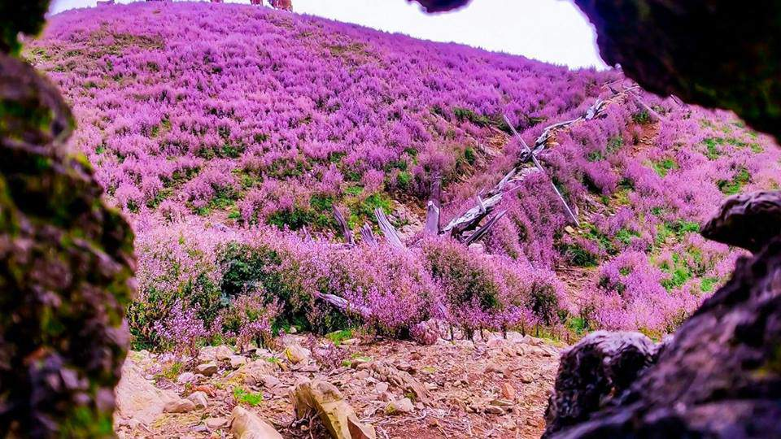 | 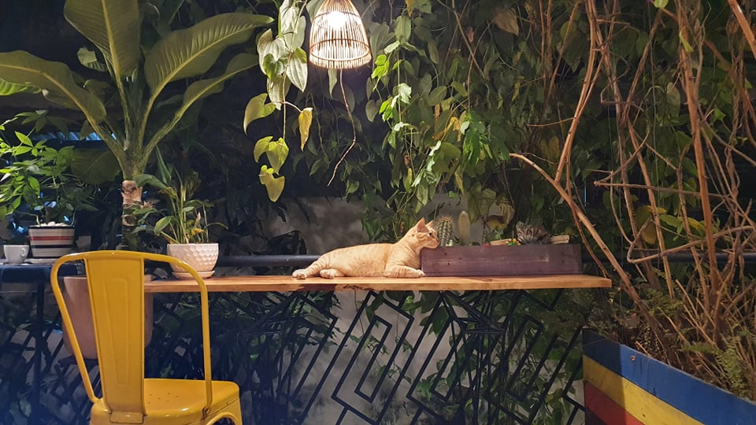 |
| ------------------------------------------------------------ | ------------------------------------------------------------ |
| `'Rừng hoa đẹp nhất hoa màu tím!'. Ảnh: Mạnh Chiến - báo Xã Hội` | `Con mèo lông vàng dễ thương ở một quán cà phê nọ (ảnh tự chụp)` |

Tiến hành sử dụng các phép biến đổi trên ma trận và thực hiện các yêu cầu của đề bài.

### 1. Thay đổi độ sáng cho ảnh:

Sau khi đập dẹp ảnh input thành `[h*w,channel]` thì ta tiến hành thay đổi độ sáng cho ảnh dựa vào công thức[^(1)]:
$$
g(x) = \alpha f(x) + \beta
$$

Với $\alpha$ hay còn gọi là `gain` và $\beta$ là `bias`. Ở đây để điều chỉnh độ sáng cho ảnh, ta sẽ điền chỉnh `beta` trong ngưỡng từ `[-255,255]` tùy vào mức độ cần chỉnh. 

```python
img_after_change_brightness = np.reshape(np.clip(img + bri,0,255),shape).astype(np.uint8)
```
Dưới đây là ảnh sau khi thay đổi độ sáng với `bias` khác nhau:

| 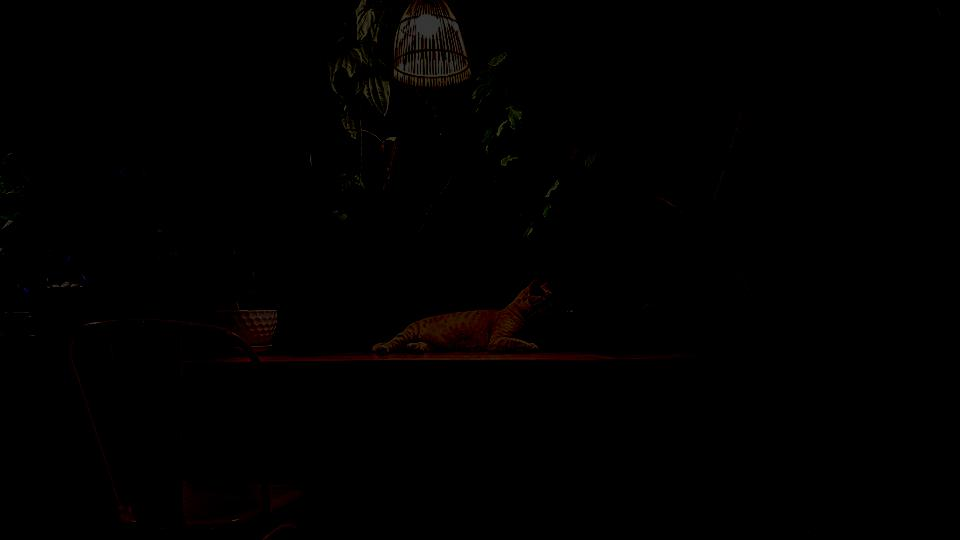 | 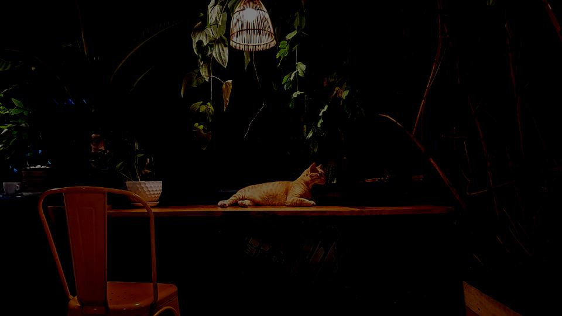 | 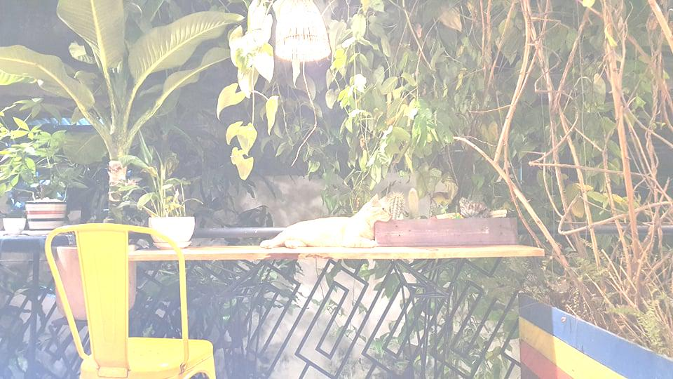 | 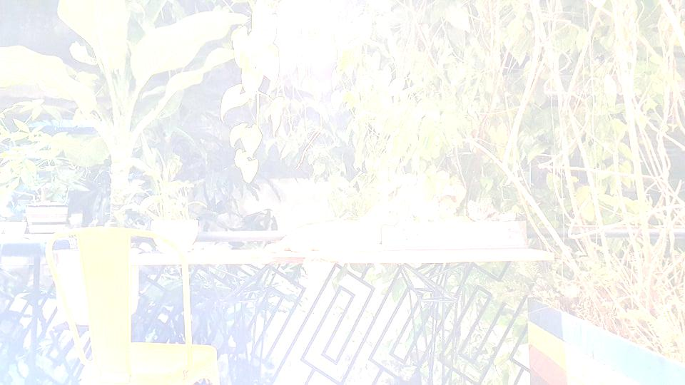 |
| :----------------------------------------------------------: | :----------------------------------------------------------: | :----------------------------------------------------------: | :----------------------------------------------------------: |
|                        $\beta = -200$                        |                        $\beta = -128$                        |                        $\beta = 128$                         |                        $\beta = 200$                         |

### 2. Thay đổi độ tương phản ảnh:

Cũng với công thức [^(1)], ta điều chỉnh `gain` để cho ra kết quả tương phản cần thay đổi. Nhưng ngoài `gain` ra thì cần tính lại constrat corection factor `F`, với công thức[^(2)]:
$$
F = \frac{259(C+255)}{255(259 - C)}
$$

Với $C$ là độ tương phản cũ. Sau đó mới điều chỉnh lại độ tương phản cho image $R$ theo:
$$
R' = F(R - 128) + 128
$$


```python
img_after_change_contrast = np.reshape(np.clip(128 + factor*(img - 128),0,255).astype(np.intc),shape).astype(np.uint8)
```

Ảnh với các `gain` khác nhau:

| 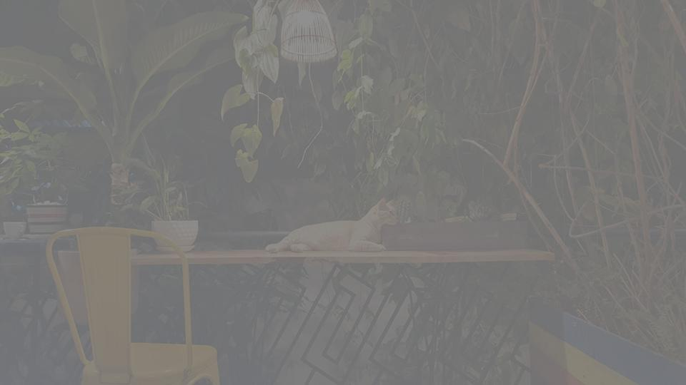 | 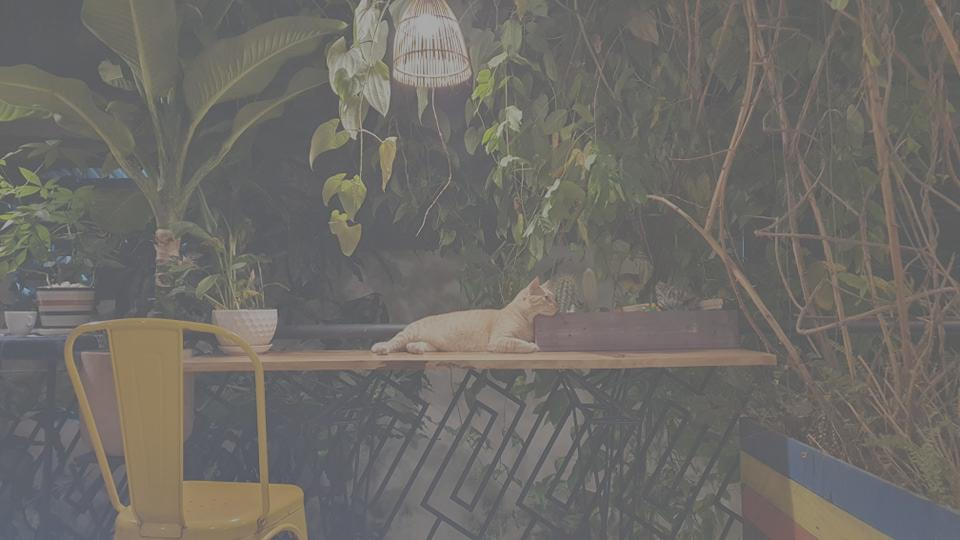 | 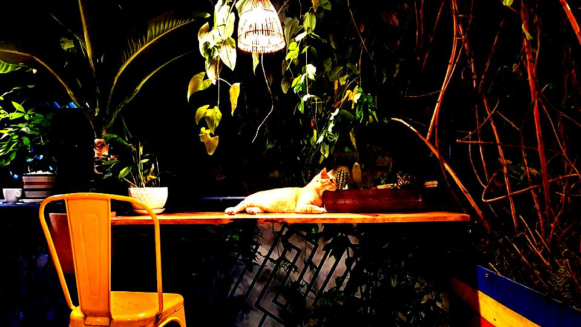 | 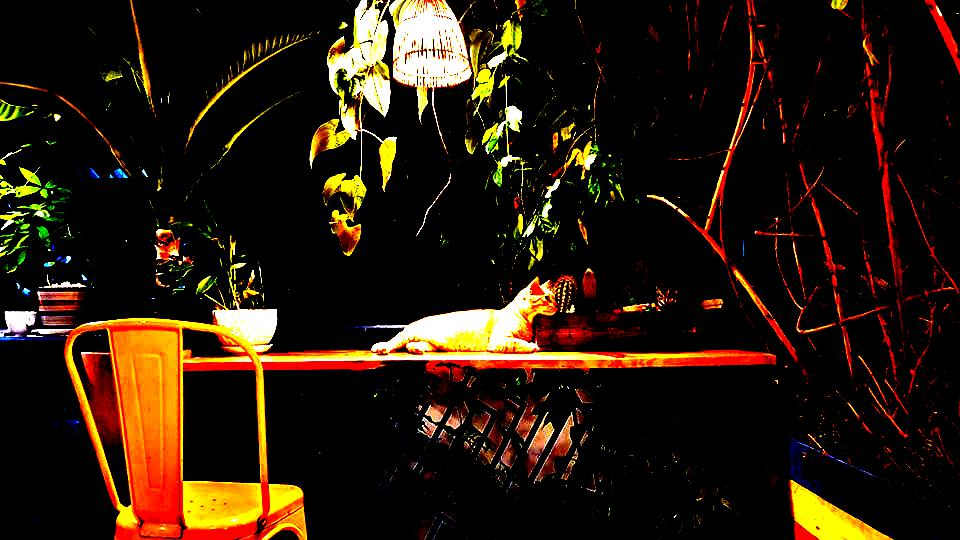 |
| :----------------------------------------------------------: | :----------------------------------------------------------: | :----------------------------------------------------------: | :----------------------------------------------------------: |
|                        $\alpha = -200$                        |                        $\alpha = -128$                        |                        $\alpha = 128$                         |                        $\alpha = 200$                         |


### 3. Chuyển đổi ảnh RGB thành ảnh xám:

Để chuyển đổi từ ảnh RGB sang ảnh xám thì theo nguồn từ Wiki[^(3)] ta chỉ cần lấy mean của ba kênh cho mỗi điểm ảnh. Nhưng làm như vậy ảnh sẽ không tự nhiên với mắt người. Ngoài phương pháp lấy trung bình ra thì còn nhiều phương pháp khác nhằm giữ sự tự nhiên của ảnh sau khi chuyển, tiêu biểu là phương `luminosity`[^(4)], 3 kênh màu sẽ được gán trọng số thay vì chia đều `33.33%` như cách lấy mean: 
$$
GRAYIMG = ( (0.3 * R) + (0.59 * G) + (0.11 * B) )
$$
Trong phần cài đặt của mình, em có cài đặt hai hàm, một hàm trả về `mean` của pixel `(mean_grayscale)` còn một hàm trả về pixel được cân bằng bằng trọng số (`avg_grayscale`). 

| 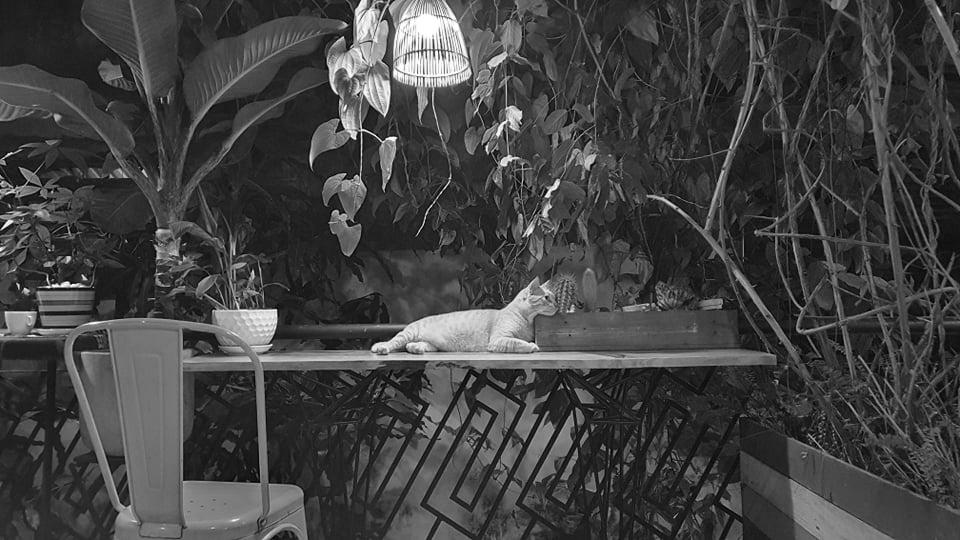 | 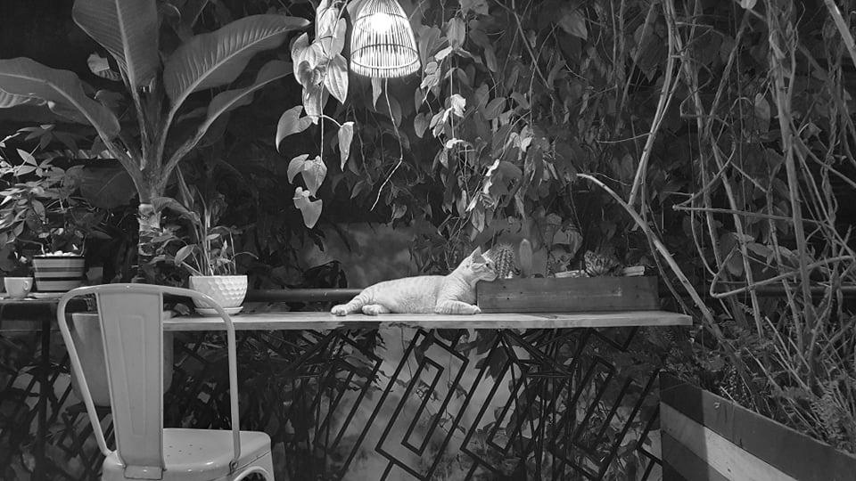 |
| :----------------------------------------------------------: | :----------------------------------------------------------: |
|                    `Grayscaling với mean`                    |                 `Grayscaling với luminosity`                 |

Kết quả cho thấy luminosity dễ nhìn hơn với mắt người và tự nhiên hơn.

### 4.  Lật ảnh (ngang - dọc) :
Đây có lẽ là phần đơn giản và dễ hiểu nhất trong bài lab này. Để lật ảnh ta cần xem sơ qua về ma trận xoay[^(5)] và từ đó lật theo góc độ mà ta muốn. Nhưng may mắn thay `Numpy` có sẵn hàm `flip` ma trận và có thể sử dụng ngay được. Tùy vào `axis` của ma trận sau khi lật mà ta sẽ có kết quả ngang, dọc tùy ý.

```python
img_after_vertical_flip = np.flip(raw_img,axis=1).astype(np.uint8)
img_after_horizontal_flip = np.flip(raw_img,axis=0).astype(np.uint8)
```

| 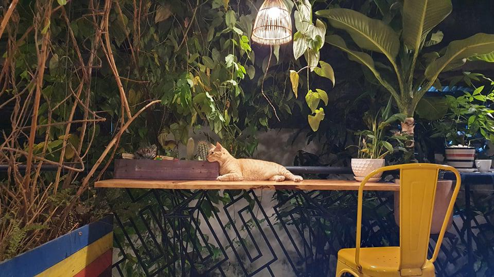 |  |
| :----------------------------------------------------------: | :----------------------------------------------------------: |
|                       `vertical flip`                        |                      `horizontal flip`                       |

###  5.  Chồng 2 ảnh cùng kích thước:

Ở đây em dùng phương pháp alpha blending[^(6)], với công thức:
$$
g(x) = (1 - \alpha)f_0(x) + \alpha f_1(x)
$$

```python
blending_img = np.uint8(alpha*(f0) + (1.0-alpha)*f1)
```

|  |  |  |
| :----------------------------------------------------------: | :----------------------------------------------------------: | :----------------------------------------------------------: |
|                            $f_0$                             |                $\alpha = 0.21424129356767163$                |                $\alpha = 0.6650459307299043$                 |
|  | 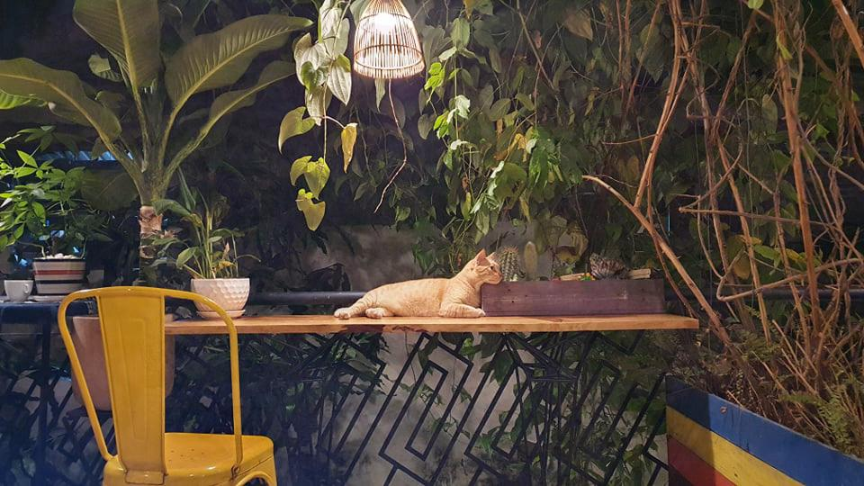 | 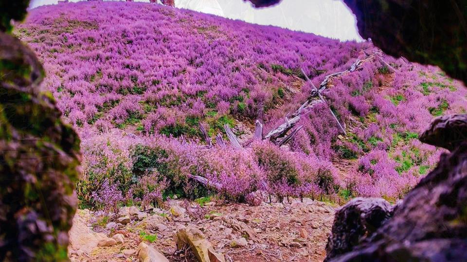 |
|                            $f_1$                             |                $\alpha = 0.05584794996910891$                |                $\alpha = 0.8789306376524272$                 |

### 6.  Làm mờ ảnh:
Về cơ bản filter ảnh nói chung và làm mờ ảnh nói riêng là ta đang tích chập một `kernel` lên tấm ảnh gốc. Khi chập `kernel` lên thì sẽ có trường hợp `kernel` bị tràn ra khỏi ảnh và từ đó ta có khái niệm về `pading`.

Trước đây em toàn dùng `opencv` để làm những chuyện này. Nhưng ở đồ án này có sự giới hạn sử dụng thư viện nên em đã tìm được cách cài đặt lại hàm `convolution` có hành vi gần giống `cv2.filter2D` nhưng hạn chế hơn tí (vì kia là cả một thư viện mà :smile:).

Cách cài đặt này được tham khảo từ một bài viết của `Ashish Kumar`[^(7)]:

```python
def convolution(image, kernel):
    """ conv2d of opencv but no opencv :) """
    image_h, image_w = image.shape[0], image.shape[1]
    kernel_h,kernel_w = kernel.shape[0],kernel.shape[1]    
    if(len(image.shape) == 3):
        image_pad = np.pad(image, pad_width=((kernel_h // 2, kernel_h // 2),(kernel_w // 2, kernel_w // 2),(0,0)), mode='constant', constant_values=0).astype(np.float32)
    elif(len(image.shape) == 2):
        image_pad = np.pad(image, pad_width=((kernel_h // 2, kernel_h // 2),(kernel_w // 2, kernel_w // 2)), mode='constant', constant_values=0).astype(np.float32)
    h = kernel_h // 2
    w = kernel_w // 2
    image_conv = np.zeros(image_pad.shape)
    
    for i in range(h, image_pad.shape[0]-h):
        for j in range(w, image_pad.shape[1]-w):
            x = image_pad[i-h:i-h+kernel_h, j-w:j-w+kernel_w]
            x = x.flatten()*kernel.flatten()
            image_conv[i][j] = x.sum()
    h_end = -h
    w_end = -w
    
    if(h == 0):
        return image_conv[h:,w:w_end]
    if(w == 0):
        return image_conv[h:h_end,w:]
    return image_conv[h:h_end,w:w_end]
```

Mọi thứ đơn giản rồi, giờ ta chỉ cần tạo `filter/kernel` riêng cho mình rồi bỏ vào thôi. Ở đây em có thử cài đặt cả `Box Blur` và `Gaussian Kernel`.

```python
def GaussianKernel(sigma):
    """ Return Gaussian Kernel depend on non-zero sigma as param"""
```

```python
def BoxKernel():
    """ Box Blur Kernel for blur"""
```

Gaussian kernel được sinh tự động chứ không lấy xấp sỉ. Trong đó công thức của hàm `Gaussian`[^(8)] như sau:
$$
G_\sigma = \frac{1}{2\pi\sigma^2}e ^{-\frac{x^2 + y^2}{2\sigma^2}}
$$

Đây là kết quả thu được:

|  |
| :----------------------------------------------------------: |
|                          `Original`                          |


|  |  |
| :----------------------------------------------------------: | :----------------------------------------------------------: |
|                          `Box Blur`                          |                  `Gaussian`, $\sigma$ = `1`                  |
|  |  |
|                  `Gaussian`, $\sigma$ = `2`                  |                  `Gaussian`, $\sigma$ = `3`                  |

## Kết luận:

Qua bài lab lần này, em có được nhiều kiến thức hơn về việc ứng dụng những gì mình đã học về ma trận vào trong xử lí ảnh. Có những thứ hết sức đơn giản thường ngày mình làm bằng `opencv` hoặc một số thư viện khác xử lí ảnh rất mượt mà nhưng đến lúc cài đặt lại như thế này ta mới hiểu bên dưới được hoạt động như thế nào.

Do có nhiều đồ án khác bủa vây xung quanh nên thời gian dành cho đồ án này cũng không đủ nhiều để phát triển sâu thêm ( tìm hiểu thêm các kernel khác cho yêu cầu blur, thử các chuẩn cân bằng gray khác,...). Nhưng đánh giá sơ bộ hiện tại thì các chức năng đều hoàn thành tốt và đầy đủ. Vì đồ án ở mức cài đặt và trải nghiệm nên không có phần chứng minh các công thức hoặc lý giải tại sao nhưng trong quá trình tìm hiểu để làm đồ án thì nguồn gốc của những công thức đó cũng rất thú vị. Ví dụ như tại sao lại có `constrast factor adjustments` với công thức như trên? Ở cuối bài tác giả cũng không giải thích được :>. Hay tích chập `kernel` có thể tính nhanh với `fast fourier transform`[^(10)] nhưng cũng chưa có thời gian để thử cải tiến.

Để hoàn thiện bài lab này, không thể kể đến các thầy cô giảng dạy cùng đội ngũ trợ giảng nhiệt tình, tận tâm với tụi em ở môn học này, chúc mọi người sức khỏe và niềm vui trong công việc giảng dạy tại HCMUS.


##  References:

[^(1)]:https://docs.opencv.org/master/d3/dc1/tutorial_basic_linear_transform.html

[^(2)]: https://www.dfstudios.co.uk/articles/programming/image-programming-algorithms/image-processing-algorithms-part-5-contrast-adjustment/

[^(3)]: https://en.wikipedia.org/wiki/Grayscale#Converting_color_to_grayscale

[^(4)]: https://www.tutorialspoint.com/dip/grayscale_to_rgb_conversion.htm

[^(5)]: https://en.wikipedia.org/wiki/Rotation_matrix

[^(6)]: https://docs.opencv.org/3.4/d5/dc4/tutorial_adding_images.html
[^(7)]: https://medium.com/@akumar5/computer-vision-gaussian-filter-from-scratch-b485837b6e09
[^(8)]: https://medium.com/spinor/a-straightforward-introduction-to-image-blurring-smoothing-using-python-f8870cf1096
[^(9)]: http://pages.stat.wisc.edu/~mchung/teaching/MIA/reading/diffusion.gaussian.kernel.pdf.pdf
[^(10)]: http://pyopengl.sourceforge.net/pydoc/numpy.fft.fftpack.html

****
<center><b> Have a Great Day </b></center>

